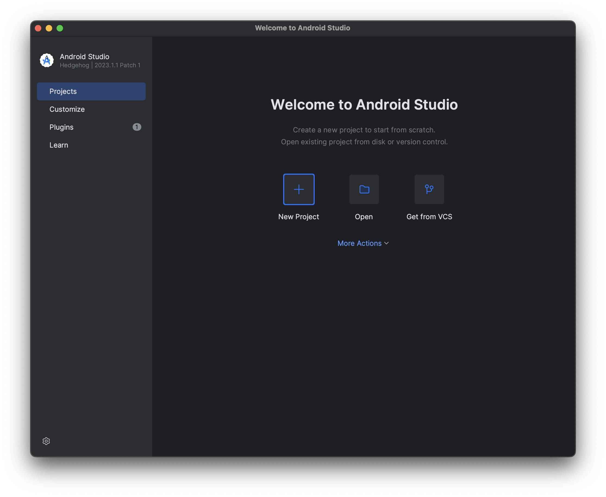
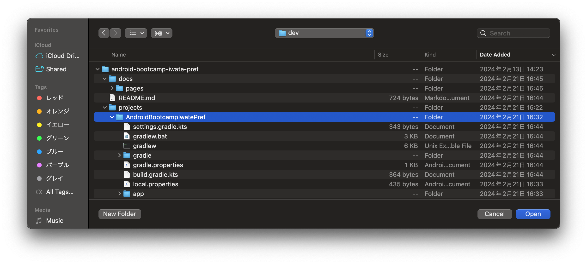
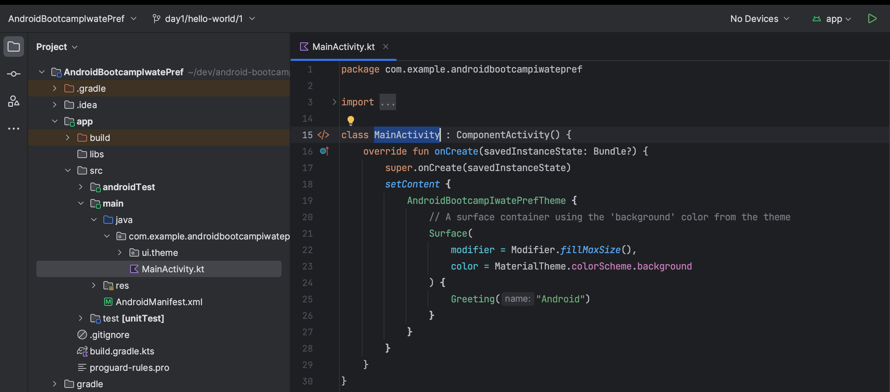
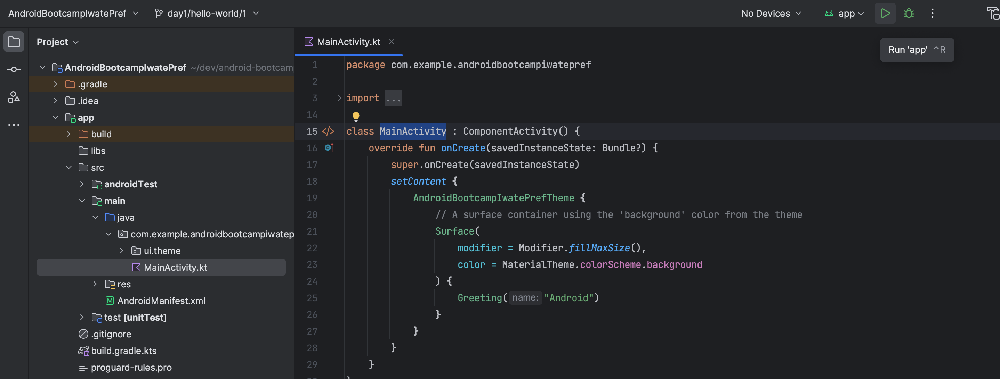
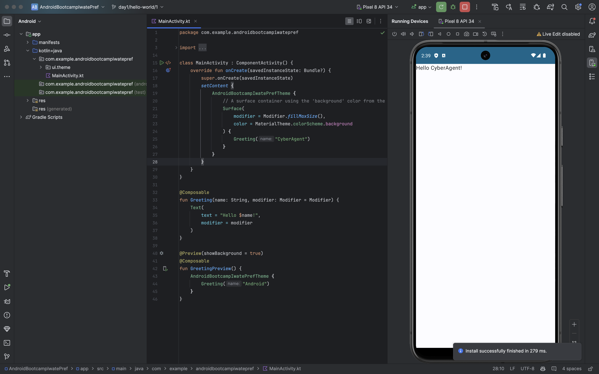

# Hello, World！

このページでは、今後のブートキャンプを通して利用するAndroidプロジェクトを開き、はじめてアプリをビルドするまでの手順を説明します。

なお、Androidプロジェクトの`clone`とAndroidStudioのセットアップ後の手順を説明するので、事前に[README](../../../README.md)を参考に準備してください。

## Androidプロジェクトを開く

Androidのウィザードの[Open]をクリックします。

ファイルを選択するポップアップが表示されたら、`clone`したリポジトリ内の`AndroidBootcampIwatePref`を選択します。

> [!IMPORTANT]
> Androidプロジェクトは[Gradle](https://gradle.org)というビルドツールによってビルドされるため、`gradle.properties`などがルートにあるプロジェクトを選択する必要があります。

## プロジェクトを同期させる

はじめてAndroidプロジェクトを開くと、自動的にプロジェクトの同期処理が始まります。
この処理中に主に以下の処理がされます。

- ライブラリのダウンロード
- 依存関係の解決

基本的に作業は不要ですが、場合によっては同期エラーになる場合があります。

## MainActivityを見つける

`:app`モジュール内のMainActivityを開いてみましょう。

`Activity`の役割や`onCraete`などのライフサイクルの細かな説明はここでは省きますが、今はアプリの起動時に初めに実行されるコードが記載されていると思って良いです。

## アプリをビルドする

Androidアプリをデバイスにインストールして使うためには、アプリをビルドする必要があります。

ビルドとは、Androidで実行できるファイルを作成するプロセスを指します。  
このプロセスには、コンパイル、難読化、圧縮など様々な工程があります。

Android StudioのGUIからビルドするには、右上の実行ボタンをクリックします。

ビルドに成功すると画面に「Hello Android!」という文字が表示されます。

> [!TIP]
> スクリーンショットではエミュレータでアプリを起動していますが、実機でも起動することは可能です。

## 表示する文字列を変更する

`MainActivity`内で`Greeting(...)`関数の呼び出し箇所を見つけましょう。  
`"Android"`という文字列を引数にとって、挨拶をしてくれる関数なので、ここを好きな文字に替え、再度ビルドをしてみましょう。

そして、アプリに表示される文字列が替わることを確認してください。

このようにコードを変更し、ビルドして、アプリの挙動確認するのが基本的な開発の流れになります。